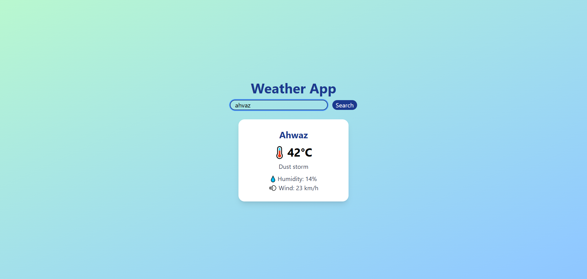

# Weather App

A simple and clean Weather application built with React and TypeScript.

## Features

- Search for weather by city name
- Display current temperature in Celsius
- Show weather condition text (e.g., "Sunny", "Rainy")
- Display weather emoji/icons
- Show additional info:
    - Humidity
    - Wind speed
    - Pressure
- Clean and simple user interface
- Responsive design

## 📸 Screenshots

### Main View (Before Search)


### Search Feature (City Selected)


## Tech Stack

- React
- TypeScript
- JavaScript
- HTML
- CSS
- Tailwind CSS

## Prerequisites

Make sure you have Node.js and npm installed on your computer.

## Getting Started

### 1. Install Dependencies

```bash
npm install
```

### 2. Run the Development Server

```bash
npm run dev
```

Open the local URL displayed in the terminal.

### 3. Build for Production

```bash
npm run build
```

## Main Files

- `App.tsx` - Main application component with weather fetch logic
- `WeatherDisplay.tsx` - Component for displaying weather information
- `SearchBar.tsx` - Component for searching cities
- `WeatherCard.tsx` - Component for individual weather data cards
- `weather.ts` - Weather data types and definitions

Additional files exist in the project.

## API Reference

This application uses the wttr.in API to fetch weather data. It's a free, anonymous weather service that doesn't require an API key.

## How it works:

The app sends a request to: https://wttr.in/{cityName}?format=j1

The ?format=j1 parameter returns data in JSON format

The app then parses and displays the weather information

## Author

Kiana Avizeh

GitHub: https://github.com/kianavz2000
